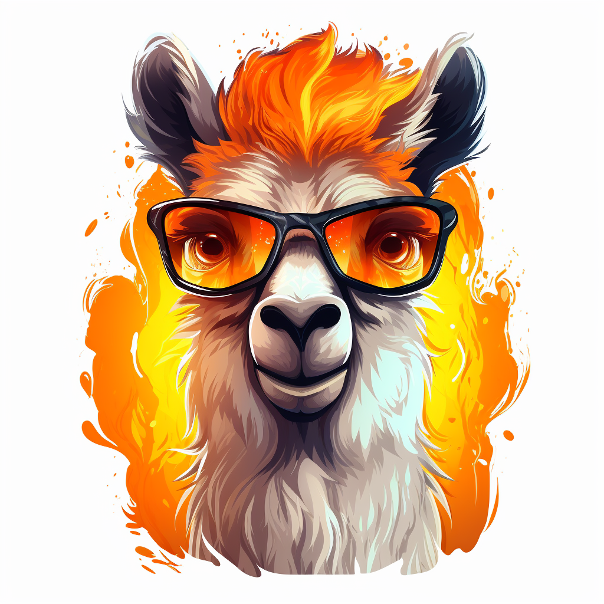
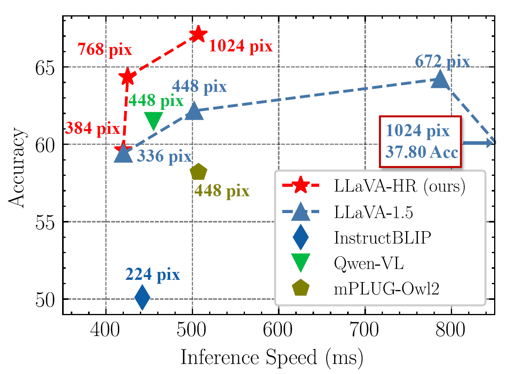

<p align="center">
    
<p>

<h2 align="center">🌋🌋 <a href="https://arxiv.org/abs/xxx">LLaVA-HR: High-Resolution Large Language-Vision Assistant </a>🌋🌋</h2>

<h5 align="center">
    
[](https://huggingface.co/favor123)
[](https://huggingface.co/papers/XXX)
[](https://arxiv.org/abs/2403.03003) 
[](https://github.com/luogen1996/LLaVA-HR/blob/main/LICENSE) 
[](https://hits.seeyoufarm.com)
[](https://github.com/luogen1996/LLaVA-HR/issues?q=is%3Aopen+is%3Aissue)
[](https://github.com/luogen1996/LLaVA-HR/issues?q=is%3Aissue+is%3Aclosed)  <br>
</h5>

✨Technical Report:
> [**Feast Your Eyes:  Mixture-of-Resolution Adaptation for Multimodal Large Language Models**](https://arxiv.org/abs/2403.03003) <br>
> Gen Luo, Yiyi Zhou, Yuxin Zhang, Xiawu Zheng, Xiaoshuai Sun, Rongrong Ji <br>[](https://arxiv.org/abs/2403.03003) <br>

This repository contains the implementation of LLaVA-HR,  a strong and efficient MLLM powered by our mixture-of-resolution adaptation.  The features of LLaVA-HR include:

- **High Image Resolutions**:  LLaVA-HR supports up to 1536 x 1536 image resolutions,  which boosts the performance of fine-grained vision-language tasks, such as TextVQA.
- **Remarkable Efficiency**: LLaVA-HR maintains the similar training costs with LLaVA-1.5, *e.g.,* **~20 hours on 8 A100s**. Its inference speed is also fast as existing low-resolution MLLMs !  Check out [our paper](https://arxiv.org/abs/2403.03003).
- **Strong Performance**: LLaVA-HR outperforms existing MLLMs on multiple benchmarks, *e.g.,* 82.6 on VQAv2.  **LLaVA-HR  is comparable to LLaVA-NexT** using the training data of LLaVA-1.5 ! Check out our [model zoo](#model-zoo).
- **Fair Comparison**: LLaVA-HR adopts the same training data and configurations with LLaVA-1.5,  which means that the performance gains all come from our mixture-of-resolution adaptation. We hope that LLaVA-HR can be a strong baseline for the community.

<div  align="center">    

</div>

## 📣 News
- **[2024.04.16]**  We fix the evaluation bug for SQA and MMVet. Now, LLaVA-HR-X can achieve 40.3 score in MMVet! checking our [model zoo](#model-zoo).

- **[2024.03.06]**  🔥🔥🔥 We release LLaVA-HR, a high-resolution MLLM with strong performance and remarkable efficiency.  LLaVA-HR greatly outperforms LLaVA-1.5 on multiple benchmarks, checking our [model zoo](#model-zoo).


## Table of Contents

- [Install](#install)
- [Model Zoo](#model-zoo)
- [Training](#training)
- [Evaluation](#evaluation)
- [Demo](#-demo)

## Install

1. Clone this repository and navigate to LLaVA-HR folder
```bash
git clone https://github.com/luogen1996/LLaVA-HR.git
cd LLaVA-HR
```

2. Install Package
```Shell
conda create -n llava-hr python=3.10 -y
conda activate llava-hr
pip install --upgrade pip  # enable PEP 660 support
pip install -e .
```

3. Install additional packages for training cases
```
pip install ninja
pip install flash-attn --no-build-isolation
```

## Model Zoo
| Version | Size | Res | Checkpoint | VQAv2 | GQA |VizWiz |TextVQA|OKVQA | OCRVQA | SQA  | MME | POPE | SEED |  MM-Vet |
|----------|----------|-----------|-----------|---|---|---|---|---|---|---|---|---|---|---|
| LLaVA-1.5 | 13B | 336 | [liuhaotian/llava-v1.5-13b](https://huggingface.co/liuhaotian/llava-v1.5-13b) | 80.0 | 63.3 |53.6 | 61.3 | - | - | **71.6** |  1531.3 | 85.9 | 61.6 | 35.4 |
| LLaVA-HR | 7B | 1024 | [favor123/llava-hr-7b-sft-1024](https://huggingface.co/favor123/llava-hr-7b-sft-1024) | 81.9 | 64.2 | 48.7 | 67.1  | 58.9 | 68.4 | 67.9 | **1554.9** | 87.6 | 64.2 | 31.5 |
| LLaVA-HR-X | 13B | 1024 | [favor123/llava-hr-13b-x-sft-1024](https://huggingface.co/favor123/llava-hr-13b-x-sft-1024) | **82.6** | **65.2**| **56.6** | **70.9** | **61.5** | **69.0** | 69.7 | 1487.3 | **88.0** | **65.3** | **40.3** |

## Training
Our training pipeline and datasets  are directly borrowed from [LLaVA-v1.5](https://github.com/haotian-liu/LLaVA). The training consists of two stages: 
- *Low-resolution pretraining*: train a projector on a subset of ∼558K image-text pairs to connect a frozen pretrained vision encoder and a frozen LLM.
- *High-resolution instruction tuning*:  adopt our MR-Adaptation to accommodate high-resolution images, and  fine-tune the whole MLLM  with multimodal instruction data.


<details>
<summary>Training scripts </summary>

### Stage-1: Low-resolution  Pretraining

Please download the caption annotations `blip_laion_cc_sbu_558k.json` and images from [here](https://huggingface.co/datasets/liuhaotian/LLaVA-Pretrain).  Move the downloaded files to the  `/data/data` folder.  Then run the following command to start the training process:

``` shell
bash scripts/v1_5/pretrain_llava_hr.sh
```
We recommend to directly use our pre-trained projector for better reproducing our results. 
| Version | Vision Encoder | Projection | Pretrain Data | Pretraining schedule | Download |
|----------|----------------|---------------|----------------------|----------|----------|
| LLaVA-HR-7b | CLIP-L & ConvNeXt-L | MLP-2x | LCS-558K | 1e | [projector](https://huggingface.co/favor123/llava-hr-7b-pretrain-384) |
| LLaVA-HR-X-13b | CLIP-L & ConvNeXt-XXL | MLP-2x | LCS-558K | 1e | [projector](https://huggingface.co/favor123/llava-hr-13b-x-pretrain-384) |

### Stage-2: High-resolution Instruction Tuning

Please download the annotation file of the mixed instruction tuning data [llava_v1_5_mix665k.json](https://huggingface.co/datasets/liuhaotian/LLaVA-Instruct-150K/blob/main/llava_v1_5_mix665k.json), and download the images from constituting datasets:

- COCO: [train2017](http://images.cocodataset.org/zips/train2017.zip)
- GQA: [images](https://downloads.cs.stanford.edu/nlp/data/gqa/images.zip)
- OCR-VQA: [download script](https://drive.google.com/drive/folders/1_GYPY5UkUy7HIcR0zq3ZCFgeZN7BAfm_?usp=sharing), **save all files as `.jpg`**
- TextVQA: [train_val_images](https://dl.fbaipublicfiles.com/textvqa/images/train_val_images.zip)
- VisualGenome: [part1](https://cs.stanford.edu/people/rak248/VG_100K_2/images.zip), [part2](https://cs.stanford.edu/people/rak248/VG_100K_2/images2.zip)

After downloading all of them, organize the data as follows in `./playground/data`:

```
├── coco
│   └── train2017
├── gqa
│   └── images
├── ocr_vqa
│   └── images
├── textvqa
│   └── train_images
└── vg
    ├── VG_100K
    └── VG_100K_2
```

Then, you can start the training process by the following script. If you use your custom dataset, you can refer to `llava_v1_5_mix665k.json` to format your data.

``` shell
bash scripts/v1_5/train_eval_llava_hr.sh
```
Instruction tuning  takes around 16 hours for LLaVA-HR-7B on 8x A100s (80G).

</details>

## Evaluation
We follow  [LLaVA-v1.5](https://github.com/haotian-liu/LLaVA/tree/main) to conduct evaluations. you should download [eval.zip](https://drive.google.com/file/d/1atZSBBrAX54yYpxtVVW33zFvcnaHeFPy/view?usp=sharing) and unzip it to `./playground/data/eval`.  Besides, we further implement the evaluation of coco-caption, refcoco, vizwiz,ocrvqa and okvqa. Please refer to [Evaluation.md](./Evaluation.md) to prepare the data.   

Then, your can run our evaluation script `bash scripts/v1_5/eval.sh`. 

## 🤗 Demo

### Gradio Web UI  <a href='https://github.com/gradio-app/gradio'></a>

Here are the steps to run the demo on your local devices.
<details>
<summary>Demo  scripts </summary>
To launch a Gradio demo locally, please run the following commands one by one. If you plan to launch multiple model workers to compare between different checkpoints, you only need to launch the controller and the web server *ONCE*.
#### Launch a controller
```Shell
python -m llava.serve.controller --host 0.0.0.0 --port 10000
```

#### Launch a gradio web server.
```Shell
python -m llava.serve.gradio_web_server --controller http://localhost:10000 --model-list-mode reload
```
You just launched the Gradio web interface. Now, you can open the web interface with the URL printed on the screen. You may notice that there is no model in the model list. Do not worry, as we have not launched any model worker yet. It will be automatically updated when you launch a model worker.

#### Launch a model worker

This is the actual *worker* that performs the inference on the GPU.  Each worker is responsible for a single model specified in `--model-path`.

```Shell
python -m llava.serve.model_worker --host 0.0.0.0 --controller http://localhost:10000 --port 40000 --worker http://localhost:40000 --model-path ./checkpoints/llava-hr-7b-sft-1024
```
Wait until the process finishes loading the model and you see "Uvicorn running on ...".  Now, refresh your Gradio web UI, and you will see the model you just launched in the model list.

You can launch as many workers as you want, and compare between different model checkpoints in the same Gradio interface. Please keep the `--controller` the same, and modify the `--port` and `--worker` to a different port number for each worker.
```Shell
python -m llava.serve.model_worker --host 0.0.0.0 --controller http://localhost:10000 --port <different from 40000, say 40001> --worker http://localhost:<change accordingly, i.e. 40001> --model-path <ckpt2>
```

If you are using an Apple device with an M1 or M2 chip, you can specify the mps device by using the `--device` flag: `--device mps`.

#### Launch a model worker (Multiple GPUs, when GPU VRAM <= 24GB)

If the VRAM of your GPU is less than 24GB (e.g., RTX 3090, RTX 4090, etc.), you may try running it with multiple GPUs. Our latest code base will automatically try to use multiple GPUs if you have more than one GPU. You can specify which GPUs to use with `CUDA_VISIBLE_DEVICES`. Below is an example of running with the first two GPUs.

```Shell
CUDA_VISIBLE_DEVICES=0,1 python -m llava.serve.model_worker --host 0.0.0.0 --controller http://localhost:10000 --port 40000 --worker http://localhost:40000 --model-path ./checkpoints/llava-hr-7b-sft-1024
```
</details>


### CLI Inference

Here is the command for chatting with LLaVA-HR without the need of Gradio interface.  

```Shell
python -m llava.serve.cli \
    --model-path ./checkpoints/llava-hr-7b-sft-1024 \
    --image-file "./assets/example.jpg" 
```


## 👍 Acknowledgement

- [LLaVA](https://github.com/haotian-liu/LLaVA) The codebase we built upon, and our baseline LLaVA-1.5 already has strong multimodal capabilities.

## 🔒 License

- The majority of this project is released under the Apache 2.0 license as found in the [LICENSE](https://github.com/luogen1996/LLaVA-HR?tab=Apache-2.0-1-ov-file) file.
- The service is a research preview intended for non-commercial use only, subject to the model [License](https://github.com/facebookresearch/llama/blob/main/MODEL_CARD.md) of LLaMA and [Terms of Use](https://openai.com/policies/terms-of-use) of the data generated by OpenAI. Please contact us if you find any potential violation.


## ✏️ Citation

If you find our paper and code useful in your research, please consider giving a star ⭐️ and citation 📝.

```bibtex
@article{luo2024feast,
  title={Feast Your Eyes: Mixture-of-Resolution Adaptation for Multimodal Large Language Models},
  author={Gen Luo, Yiyi Zhou, Yuxin Zhang, Xiawu Zheng, Xiaoshuai Sun, Rongrong Ji},
  journal={arXiv preprint arXiv:2403.03003},
  year={2024}
}
```

## ✨ Star History

[](https://star-history.com/#luogen1996/LLaVA-HR&Date)

